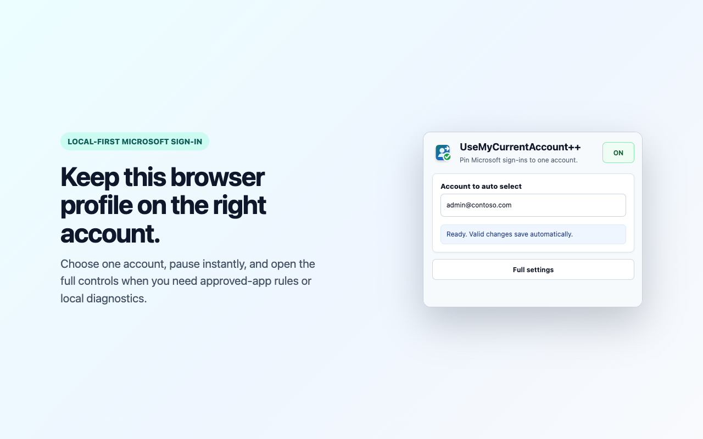
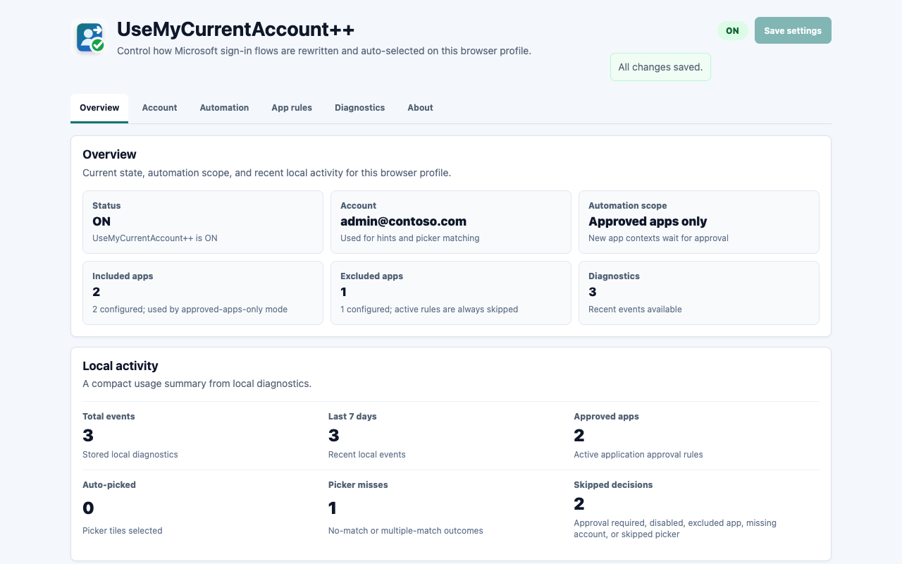
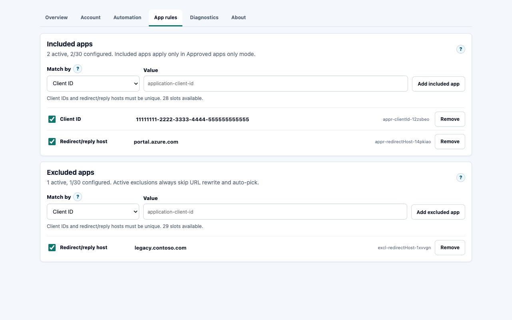
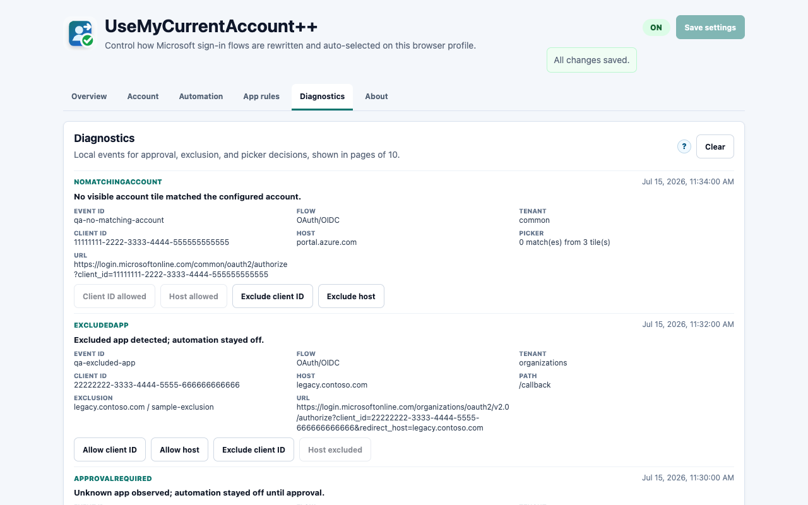

# UseMyCurrentAccount++

UseMyCurrentAccount++ is a Chromium Manifest V3 extension for Microsoft Edge and Chrome. It helps Microsoft sign-in flows use the account configured for the current browser profile instead of repeatedly showing the Microsoft account picker.

It is a full rewrite inspired by Claire Novotny LLC's original [UseMyCurrentAccount](https://github.com/novotnyllc/UseMyCurrentAccount) extension, with a modern MV3 architecture, editable account targeting, safer diagnostics, and a fail-closed account-picker fallback.

Current version: **v1.1.2**

## What It Does

- Adds `login_hint` and `domain_hint` to Microsoft OAuth/OIDC authorize URLs only when the application did not already provide an account or domain hint.
- Preserves application-provided `login_hint`, `domain_hint`, or `username` values without rewriting that request, preventing extension-created duplicate hints.
- Adds `whr` to Microsoft SAML and WS-Fed sign-in URLs.
- Optionally removes the prompt parameter when it is exactly `prompt=select_account`.
- Auto-clicks a Microsoft account-picker tile only when exactly one visible tile matches the account to auto select or configured aliases.
- Supports an approved-apps-only mode: unknown Microsoft sign-in requests are observed and logged, then you can approve the same client ID or redirect/reply host from diagnostics for next time.
- Keeps the popup focused on ON/OFF and account entry, with advanced behavior controls in the full settings page.
- Stores all settings and diagnostics locally in the browser profile.

## Screenshots

Quick popup control:



Settings overview:



Approved and excluded application rules:



Sanitized local diagnostics:



## Install For Development

This repository uses pnpm:

```powershell
pnpm install
pnpm test
pnpm run build
```

Then load `dist/` from `edge://extensions` or `chrome://extensions`.

## Manual Verification

1. Load `dist/` as an unpacked extension.
2. Open the popup and configure the account to auto select, for example `admin.user@example.com`.
3. Visit a Microsoft OAuth authorize flow that normally shows "Pick an account".
4. Confirm the flow either skips the picker or auto-selects the exact matching account.
5. Visit an authorize URL that already contains `login_hint` and confirm the extension leaves the URL and prompt unchanged.
6. Disable the extension from the popup and confirm Microsoft sign-in is no longer modified.
7. Clear the account to auto select and confirm no automatic click happens.
8. Enable approved-apps-only mode, visit a new Microsoft auth flow, and confirm diagnostics offer allow actions before that app is automated.

For a repeatable loaded-extension smoke test and Store-media refresh, build first and run:

```bash
pnpm run build
node scripts/qa-loaded-extension.mjs
```

The script loads `dist/` into an isolated temporary Microsoft Edge profile, intercepts safe local Microsoft-login fixtures, checks service-worker/storage/message/DNR/popup/settings behavior, and regenerates the RGB Store assets. It uses the standard macOS Edge path by default; set `EDGE_BIN` to override it.

## Privacy

UseMyCurrentAccount++ is local-first. It does not send account settings or diagnostics to the developer or an analytics service. When URL rewriting is enabled, the browser sends the configured account or domain hint directly to Microsoft's `login.microsoftonline.com` service as part of the sign-in request.

See [PRIVACY.md](PRIVACY.md) for the publication-ready privacy notice.

Use of the extension is also governed by the [Terms of Use](TERMS.md).

## Limitations

- The extension cannot read the Windows connected-account list directly. Where Chrome or Edge supports it, browser identity is consulted only on initial installation to prefill the normal editable account field. No separate profile-email copy is retained, and clearing the account stays cleared after browser or extension restarts.
- Approved-apps-only mode controls this extension's URL rewrite and picker-click automation. It cannot clear cookies or block Microsoft from accepting an already-valid browser session.
- An application-provided OAuth/OIDC `login_hint`, `domain_hint`, or `username` takes precedence. The extension does not override that hint or suppress the application's prompt on the same request.
- OAuth/OIDC requests with a percent-encoded top-level parameter name are left untouched. Chromium's declarative rule engine cannot safely decode the name before rewriting, so the extension fails closed instead of risking a duplicate Microsoft sign-in hint.
- If Microsoft changes the account picker markup, the content script fails closed and records a diagnostic instead of clicking.
- App sign-in policies, MFA, conditional access, consent, and claims challenges can still require interactive Microsoft prompts.

## Development

```bash
pnpm install
pnpm test
pnpm run type-check
pnpm run build
```

`pnpm run verify` runs the version-sync check, strict TypeScript check, full test suite, and production build in one command.

## Releases

Every push and pull request is verified in GitHub Actions and produces a Chrome Web Store ZIP from the tested `dist/` output. A `vX.Y.Z` tag on `main` repeats the complete verification, creates an immutable GitHub release from that exact ZIP, and submits the same artifact to the Chrome Web Store API.

The initial Store item, listing, privacy declarations, and distribution settings are configured manually. Subsequent tagged updates use the repository secrets documented in [docs/CHROME_WEB_STORE_RELEASE.md](docs/CHROME_WEB_STORE_RELEASE.md). The exact listing copy and permission justifications are maintained in [docs/STORE_LISTING.md](docs/STORE_LISTING.md).

## Attribution

Original idea and MIT-licensed implementation: Claire Novotny LLC, [UseMyCurrentAccount](https://github.com/novotnyllc/UseMyCurrentAccount).

UseMyCurrentAccount++ keeps the same practical goal while updating the extension for Chromium Manifest V3 and adding explicit configuration and diagnostics.

## License

MIT. See [LICENSE](LICENSE). Third-party software notices are in [THIRD_PARTY_NOTICES.txt](THIRD_PARTY_NOTICES.txt) and are included in every release package.
