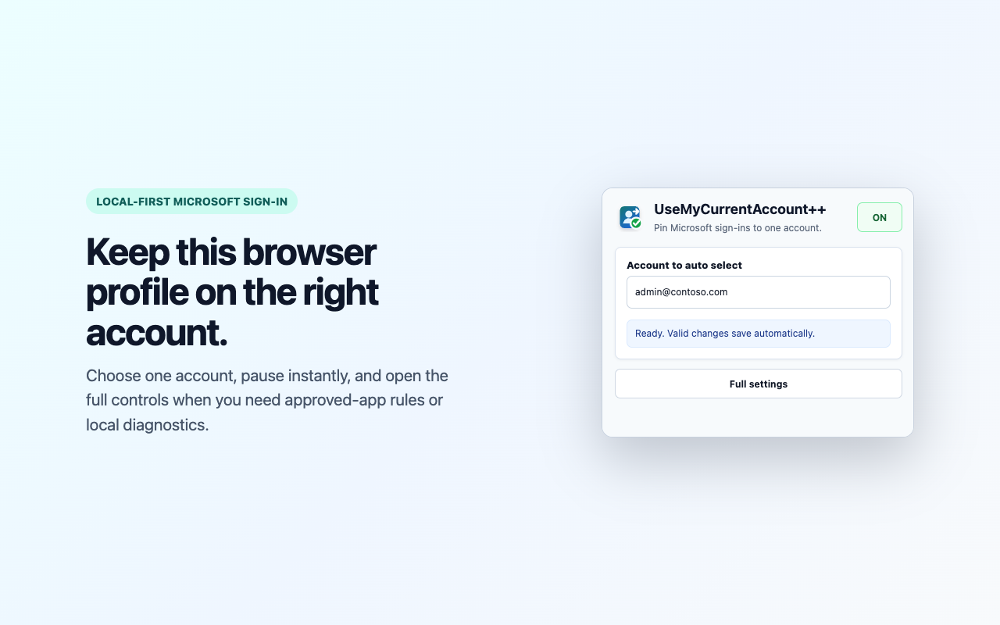
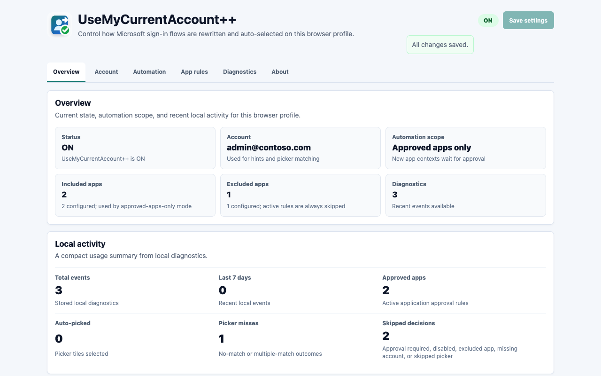
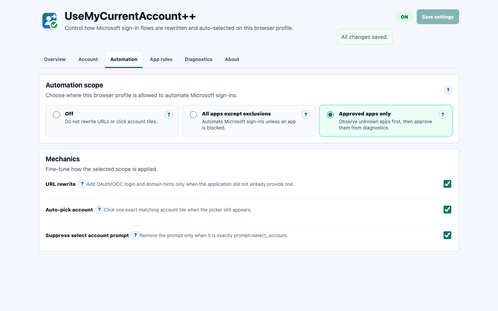
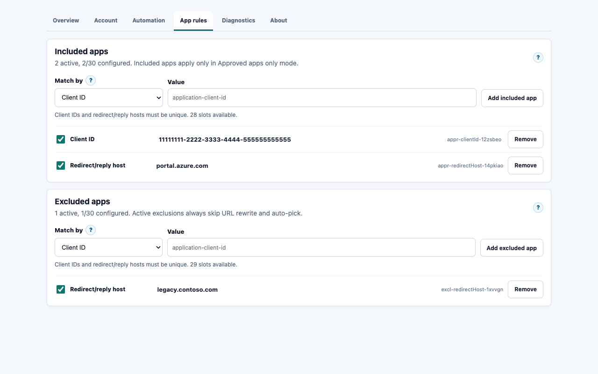
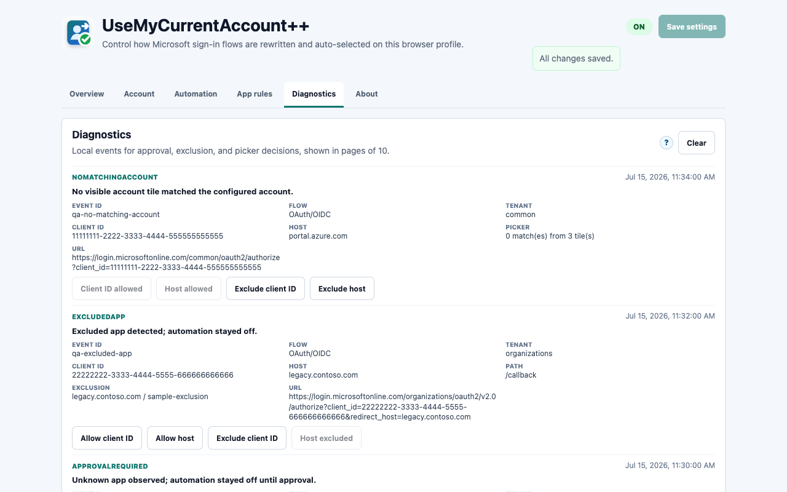

# UseMyCurrentAccount++

**Keep Microsoft sign-ins on the account chosen for this browser profile.**

UseMyCurrentAccount++ removes repeated account-picker friction while preserving application-provided sign-in choices and Microsoft security controls.

<p align="center">
  <a href="https://chromewebstore.google.com/detail/usemycurrentaccount%2B%2B/oldcfpgnklojihohiccflbgigniadgoc"></a>
  &nbsp;&nbsp;
  <a href="https://microsoftedge.microsoft.com/addons/detail/nlfohbfheaeoopghgmfjbeaepgflckkd"></a>
</p>

Current version: **v1.1.8**

[](docs/images/store-screenshot-01-popup.png)

## Stay On The Right Microsoft Account

Microsoft sign-in can repeatedly ask which cached account to use, even when a browser profile has one clear purpose. UseMyCurrentAccount++ lets you choose that account once and applies the choice only where it can do so safely.

- **Less account-picker friction:** add Microsoft sign-in hints before the page loads and select one exact matching account tile when a picker still appears.
- **Application choices take priority:** an existing `login_hint`, `domain_hint`, or `username` is never replaced or duplicated.
- **Two automation scopes:** cover all apps except explicit exclusions, or require approval for each client ID or redirect/reply host.
- **Clear local controls:** pause automation, edit aliases, manage app rules, and inspect sanitized decisions from one settings page.
- **Local-first design:** settings and diagnostics stay in the current browser profile, with no developer backend or analytics service.

## See It In Action

Click any screenshot to view it at full size.

| Profile overview | Automation scope |
| --- | --- |
| [](docs/images/store-screenshot-02-overview.png) | [](docs/images/store-screenshot-05-automation.png) |
| Confirm the selected account, current operating mode, app-rule counts, and recent local activity at a glance. | Choose **All apps except exclusions** for broad coverage or **Approved apps only** for an allow-list workflow. |

| Included and excluded apps | Explainable local diagnostics |
| --- | --- |
| [](docs/images/store-screenshot-03-approved-apps.png) | [](docs/images/store-screenshot-04-diagnostics.png) |
| Match applications by Microsoft client ID or redirect/reply host, then enable or remove each rule independently. | See why a request was approved, excluded, skipped, or could not select an account—without exposing sensitive OAuth values. |

## How It Works

1. Install the extension from the Chrome Web Store or Microsoft Edge Add-ons.
2. Open the toolbar popup and enter the Microsoft email address or UPN to use for this browser profile.
3. Open **Full settings** to choose the automation scope, add aliases, and configure application rules.
4. Continue using Microsoft sites normally. Supported sign-in requests receive an account/domain hint only when the application did not already provide one.
5. If Microsoft still shows its account picker, the extension clicks only when exactly one visible tile matches the configured account or an alias.

For OAuth/OIDC requests, UseMyCurrentAccount++ can add `login_hint` and `domain_hint` and optionally remove only an exact `prompt=select_account`. For SAML and WS-Fed sign-ins, it can add `whr`. Rewriting is limited to top-level navigation on `login.microsoftonline.com`.

## Safe By Default

UseMyCurrentAccount++ fails closed whenever a request or picker cannot be classified safely.

- Application-provided account and domain hints remain untouched.
- Percent-encoded top-level OAuth parameter names are not rewritten because Chromium rules cannot safely decode them before transformation.
- Excluded or not-yet-approved applications are skipped.
- No tile is clicked when there is no match, more than one match, or no visible actionable control.
- Microsoft sign-in policy, MFA, Conditional Access, consent, claims challenges, and application behavior remain authoritative.

## Privacy

The configured account, aliases, app rules, and sanitized diagnostics are stored locally in the browser profile. UseMyCurrentAccount++ does not send extension data to the developer, use analytics, or run a developer-controlled service.

When URL rewriting is enabled, the browser sends the selected account or domain hint directly to Microsoft's `login.microsoftonline.com` service as part of the sign-in request. Read the complete [privacy policy](PRIVACY.md) and [terms of use](TERMS.md).

## Requirements And Limits

- Microsoft Edge, Google Chrome, or another compatible Chromium browser.
- A Microsoft sign-in flow hosted on `login.microsoftonline.com`.
- One email-style account or UPN selected for the current browser profile.

The extension cannot read the Windows connected-account list directly. On first installation, supported browsers may provide the browser-profile email as an editable local prefill; clearing that field remains effective after restarts. Approved-apps-only mode controls this extension's automation, not Microsoft cookies or an already-valid Microsoft session.

## Technical Reference

The sections below cover source builds, verification, release automation, and repository maintenance. Most users only need one of the Store install buttons at the top of this page.

### Build And Load Locally

This repository uses pnpm:

```bash
pnpm install
pnpm run verify
```

Then open `edge://extensions` or `chrome://extensions`, enable **Developer mode**, choose **Load unpacked**, and select this repository's `dist/` folder.

Useful individual checks:

```bash
pnpm run check:version
pnpm run type-check
pnpm test
pnpm run build
pnpm audit
```

### Loaded-Extension Verification And Store Media

After building, run:

```bash
node scripts/qa-loaded-extension.mjs
```

The script loads `dist/` into an isolated temporary Microsoft Edge profile, intercepts safe local Microsoft-login fixtures, checks service worker, storage, messaging, URL rewriting, popup, Settings, application rules, picker behavior, and console health, then regenerates Store and README media with fictional data. It uses the standard macOS Edge path by default; set `EDGE_BIN` to override it.

### Release And Store Packaging

`pnpm run package:stores` creates one verified Chromium MV3 archive:

```text
release/usemycurrentaccount-plusplus-vX.Y.Z-chromium-stores.zip
```

A matching `vX.Y.Z` tag on `main` repeats version synchronization, type checking, tests, dependency audit, production build, loaded-extension QA, and package verification. The workflow attaches that immutable ZIP once to GitHub Releases and submits the same verified bytes through the configured Chrome and Edge publication APIs.

See [GitHub Releases](https://github.com/RobinMJD/UseMyCurrentAccount-PlusPlus/releases) for the changelog and downloadable version history. Public release configuration is documented in [Chrome Web Store release guidance](docs/CHROME_WEB_STORE_RELEASE.md), [Microsoft Edge Add-ons release guidance](docs/EDGE_ADDONS_RELEASE.md), and the browser-neutral [Store listing source](docs/STORE_LISTING.md).

### Repository Layout

- `src/`: TypeScript, React, background, popup, Settings, storage, URL-rule, and account-picker source.
- `public/`: Manifest V3 metadata, icons, and static extension assets.
- `tests/`: unit, component, publisher, package, metadata, and documentation-asset tests.
- `docs/images/`: current Store graphics, README screenshots, and official Store badges.
- `dist/`: ignored production build used for local unpacked testing.
- `release/`: ignored Store upload package and generated publication media.

## Attribution

Concept and original MIT-licensed extension: Claire Novotny LLC, [UseMyCurrentAccount](https://github.com/novotnyllc/UseMyCurrentAccount).

UseMyCurrentAccount++ is an independent Manifest V3 rewrite with its own interface, configuration model, diagnostics, tests, packaging, and release pipeline.

## License

This project is licensed under the [MIT License](LICENSE). Third-party software notices are in [THIRD_PARTY_NOTICES.txt](THIRD_PARTY_NOTICES.txt) and are included in every release package.
